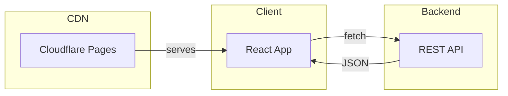

# Greeting Cards Frontend

Modern, responsive greeting cards viewer built with [React](https://react.dev/) and [Vite](https://vitejs.dev/), deployed on [Cloudflare Pages](https://pages.cloudflare.com/).

## Overview



## Prerequisites

- [Node.js](https://nodejs.org/) v18+
- [pnpm](https://pnpm.io/)
- [Cloudflare account](https://dash.cloudflare.com/)

## Installation

Install dependencies:

```sh
pnpm install
```

## Configuration

### Environment Variables

Create a `.env` file from `.env.example` and set the following:

| Variable           | Description                                                 |
| ------------------ | ----------------------------------------------------------- |
| `VITE_BACKEND_URL` | Backend API URL (e.g., `https://cards-api.phanuphats.com`). |

**Note:** All environment variables must be prefixed with `VITE_` to be exposed to the client.

## Development

Start the local development server:

```sh
pnpm run dev
```

The app will be available at `http://localhost:5173`.

## Deployment

Deploy to Cloudflare Pages:

### Option 1: Direct Deploy

```sh
pnpm run deploy
```

### Option 2: Git Integration

1. Push your code to GitHub/GitLab
2. Connect your repository in the [Cloudflare Pages dashboard](https://dash.cloudflare.com/)
3. Configure build settings:
   - **Build command:** `pnpm run build`
   - **Build output directory:** `dist`
   - **Environment variables:** Add `VITE_BACKEND_URL`

Cloudflare Pages will automatically deploy on every push.

## License

[MIT](LICENSE)
